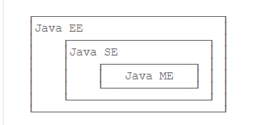
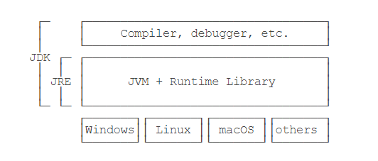

# Java的基础知识

## Java简介

​	Java是由Sun Microsystems公司于1995年5月推出的一种编程语言。它是介于**编译型语言**和**解释型语言**之间的。**编译型语言**写的代码是直接编译成机器码然后执行，**解释型语言**可以由解释器直接加载源码然后运行，代价是**运行效率太低**。而Java是将代码编译成一种**“字节码”**，它类似于抽象的CPU指令，然后，针对不同平台编写虚拟机，不同平台的虚拟机负责加载字节码并执行，这样就实现了**“一次编写，到处运行”**的效果。随着Java的发展，它又分为Java SE（标准变）、Java EE（企业版）、Java ME（微型版）这三个版本 。Java SE是整个Java平台的核心，要进行Java Web开发又需要使用Java EE里面的知识。

​	    						 

### Java语言的特性

- **面向对象**：Java语言提供类、接口和继承等面向对象的特性，为了简单起见，只支持类之间的单继承，但支持接口之间的多继承，并支持类与接口之间的实现机制（关键字为implements）。 Java语言是一个纯的面向对象程序设计语言。 
- **分布式**：Java语言支持Internet应用的开发，在基本的Java应用编程接口中有一个网络应用编程接口（java net），它提供了用于网络应用编程的类库，包括URL、URLConnection、Socket、ServerSocket等。Java的RMI（远程方法激活）机制也是开发分布式应用的重要手段。 
- **健壮**：Java的强类型机制、异常处理、垃圾的自动收集等是Java程序健壮性的重要保证。对指针的丢弃是Java的明智选择。Java的安全检查机制使得Java更具健壮性。 
- **安全**：Java通常被用在网络环境中，为此，Java提供了一个安全机制以防恶意代码的攻击。除了Java语言具有的许多安全特性以外，Java对通过网络下载的类具有一个安全防范机制（类ClassLoader），如分配不同的名字空间以防替代本地的同名类、字节代码检查，并提供安全管理机制（类SecurityManager）让Java应用设置安全哨兵。 
- **跨平台**：Java 是“一次编写，到处运行（Write Once，Run any Where）”的语言，因此采用 Java 语言编写的程序具有很好的可移植性，而保证这一点的正是 Java 的虚拟机机制。在引入虚拟机之后，Java 语言在不同的平台上运行不需要重新编译。 
- **可移植性**：这种可移植性来源于体系结构中立性，另外，Java还严格规定了各个基本数据类型的长度。Java系统本身也具有很强的可移植性，Java编译器是用Java实现的，Java的运行环境是用ANSI C实现的。 
- **高性能**：与那些解释型的高级脚本语言相比，Java的确是高性能的。事实上，Java的运行速度随着JIT(Just-In-Time）编译器技术的发展越来越接近于C++。 
- **多线程**：在Java语言中，线程是一种特殊的对象，它必须由Thread类或其子（孙）类来创建。通常有两种方法来创建线程：其一，使用型构为Thread(Runnable)的构造子类将一个实现了Runnable接口的对象包装成一个线程，其二，从Thread类派生出子类并重写run方法，使用该子类创建的对象即为线程。值得注意的是Thread类已经实现了Runnable接口，因此，任何一个线程均有它的run方法，而run方法中包含了线程所要运行的代码。线程的活动由一组方法来控制。Java语言支持多个线程的同时执行，并提供多线程之间的同步机制（关键字为synchronized）。 
- **动态**：Java语言的设计目标之一是适应于动态变化的环境。Java程序需要的类能够动态地被载入到运行环境，也可以通过网络来载入所需要的类。这也有利于软件的升级。另外，Java中的类有一个运行时刻的表示，能进行运行时刻的类型检查。 

### JDK与JRE

​	JRE(Java Runtime Environment )，也叫**Java运行环境**，就相当于运行**Java字节码**文件的**虚拟机**（JVM）。但是，如果只有Java源码，要编译成Java字节码，就需要**JDK**(Java Development Kit )，因为JDK除了包含JRE，还提供了编译器、调试器等开发工具。 

​			

#### JDK的安装

​	首先从[Oracle官网](https://www.oracle.com/java/technologies/javase-downloads.html )下载你JDK安装包，在安装的时候**安装路径中切记不要出现空格以及中文**。安装完成以后，需要在Path环境变量中添加JDK的环境，它指向你安装的JDK安装目录下的`bin`目录下，例如：

```
在我的电脑里面的环境变量path中添加：
C:\Program Files\Java\jdk1.8.0_111\bin;
```

​	设置完环境变量后，打开`cmd`输入命令：`java -version `，就可以看到

```
C:\Users\admin>java -version
java version "1.8.0_181"
Java(TM) SE Runtime Environment (build 1.8.0_181-b13)
Java HotSpot(TM) 64-Bit Server VM (build 25.181-b13, mixed mode)
```

#### JDK的目录介绍

- `bin`目录：Java工具的可执行文件，包括: java、Java编译器javac、反编译.class文件javap、密钥管理工具keytool、Java文档工具javadoc等。 

- `db`目录：Java实现的数据库。 

- `include`目录：.存放调用系统资源的接口文件 

- `lib`目录： Java类库，我们经常看到的`dt.jar`和`tools.jar`就在这个目录下。 

- `src.zip`文件：Java类库源码，包括了rt.jar库中的关键部分；除了Java类库，还包含了启动器（launcher）的源码（C语言实现）。 

- `jre`目录：Java运行环境。

## 从零走进Java

##### 最最最简单的Hello World！	

```java
public class Hello {
    public static void main(String[] args) {
        System.out.println("Hello, world!");
    }
}
```

### 输入与输出

- 输出

  ```java
  public class Main {
      public static void main(String[] args) {
          System.out.println("Hello world!"); // 输出Hello World！并且换行
          System.out.print("Hello world!"); // 输出Hello World！但不进行换行
          System.out.printf("%d",a); // 格式化输出整数a
          System.out.printf("%%x",b); // 格式化输出十六进制整数b
          System.out.printf("%f",c1); // 格式化输出浮点数c1
          System.out.printf("%.2f",c2); // 格式化输出显示两位小数的浮点数c2
          System.out.printf("%e",d); // 格式化输出科学计数法表示的浮点数d
          System.out.printf("%s",e); // 格式化输出字符串e
      }
  }  
  ```

- 输入

  ```java
  import java.util.Scanner;//1.导入输入所依赖的包
  
  public class Main {
      public static void main(String[] args) {
          Scanner scanner = new Scanner(System.in); //2. 创建Scanner对象
           //3.调用Scanner对象的方法，
          String name = scanner.nextLine(); //读取一行输入并获取字符串
          String sex = scanner.next(); //读取一行输入并获取字符串
          /*
          next()的输入时不包括有效字符前的空格(也就是在你实际输出前面所打的空格是不会输出在控制台的)；在输入有效字符后，输入的空格、Tab建、Enter建会被看作是分隔符或者结束符。
          nextLine()的输入是包括有效字符前的空格的，而且只有输入Enter建才会被视作结束输入。
          */
          int age = scanner.nextInt(); // 读取一行输入并获取整数
      }
  }
  ```

  


### 变量与数据类型

#### 变量

​	变量是指JVM在内存中分配的一个**存储区域**，该区域存放变量的变量名以及数据类型，该区域的数据可以在同一数据类型的范围内不断变化值。每个变量都有自己的作用范围，叫**作用域**(一对{}之间)	。在Java中，变量分为两种：**基本类型**的变量和**引用类型**的变量。

​	 变量必须先定义后使用，在定义变量的时候，可以给它一个初始值；如果不写初始值，就相当于给它指定了默认值。默认值总是`0`。 在`main()`方法中声明的变量叫做**局部变量**，局部变量作用范围是：**从声明开始到方法体结束**。

​	变量的命名规范：

- 以下划线、字母、美元符开头。 

- 后面跟下划线、字母、美元符以及数字。 

- 不能是Java中的关键字。

- 大小写敏感，且没有长度限制，但也不宜太长。

- 建议使用驼峰命名法。

#### 数据类型

##### 基本数据类型(8种)

- 整数类型：byte(1字节)，short(2字节)，int(4字节)，long(8字节)

- 浮点数类型：float(4字节)，double(8字节)

- 字符类型：char(2字节)

- 布尔类型：boolean(1bit)

  ​	计算机内存的最小存储单元是字节（`byte`），一个字节就是一个8位二进制数，即8个`bit`。它的二进制表示范围从`00000000`~`11111111`，换算成十进制是0~255，换算成十六进制是`00`~`ff`。 

##### 整型

​	整型是用来表示整数的基本数据类型，根据分配的空间大小又分为：	

|    数据类型     |   空间大小    |                 取值范围                 |
| :-------------: | :-----------: | :--------------------------------------: |
| byte（字节型）  | 8位，1个字节  |                 -128~127                 |
| short（短整型） | 16位，2个字节 |               -32768~32767               |
|   int（整型）   | 32位，4个字节 |          -2147483648~2147483647          |
| long（长整型）  | 64位，8个字节 | -9223372036854775808~9223372036854775807 |

##### 浮点型

​	浮点型就是用来显示小数的基本数据类型。

|        数据类型        |   空间大小    |             取值范围             |
| :--------------------: | :-----------: | :------------------------------: |
| float（单精度浮点型）  | 32位、4个字节 |      1.4E-45~3.4028235-E38       |
| double（双精度浮点型） | 64位、8个字节 | 4.9E-324~1.7976931348623157E-308 |

##### 字符类型

​	字符类型为表示单个字符的基本数据类型，字符类型用来保存单个字符或者汉字。

##### 布尔类型

​	布尔类型是用来逻辑状态（`true`或者`false`）的基本数据类型。理论上存储布尔类型只需要`1 bit`，但是通常JVM内部会把`boolean`表示为`4 byte`整数。 

##### 常量

​	再定义变量的时候，如果加上`final`修饰符，那么定义的这个变量就成为了常量。`final double PI = 3.14;`常量在定义时进行初始化后就**不**可再次赋值，再次赋值会导致**编译错误**。 根据习惯，常量名通常全部大写。 

#### 类型转化

​	把一种数据类型转化为另一种数据类型的过程叫做类型转化。

##### 基本类型转化
​	Java中的基本类型转化分为**自动类型转化**和**强制类型转化**。根据取值范围的大小，把八种数据类型分为低级到高级，又低级的数据类型转化为高级的数据类型被称作为自动类型转化，又高级的数据类型转化为低级的数据类型被称作为强制类型转换；在转化过程中，如果原始类型的取值范围超出了目标类型的取值范围就会得到错误的结果。

```java
   //自动类型转化	 
    short s = 1234;
    int i = 123456;
    int x = s + i; // s自动转型为int
   //强制类型转化
	int i = 12345;
	short s = (short) i; // 12345
```

##### 引用类型转化

​	引用类型之间的转化只能发生在两个类型之间具有继承关系的前提下进行，就是说一个类型是另一个类型的子类类型。不具备继承关系的两个引用类型变量是不能进行引用类型转换的。否则程序会引发  `ClassCastException`异常。

- 向上转型

  把一个子类类型安全地变成父类类型的赋值操作，被称为向上转型（upcasting）；向上转型实际上是把一个子类型安全地转变为更加抽象的父类类型 。 
    ```java
  //继承关系：Student > Person > Object
  Student s = new Student();
  Person p = s; // upcasting, ok
  Object o1 = p; // upcasting, ok
  Object o2 = s; // upcasting, ok
  
    ```

- 向下转型

  和向上转型相反，如果把一个父类类型强制转型为子类类型，就是向下转型（downcasting）。 再向下转型的时候可能会转型失败，然后Java虚拟机会报一个`ClassCastException`。

```java
//继承关系：Student > Person > Object
Person p1 = new Student(); // upcasting, ok
Person p2 = new Person();
Student s1 = (Student) p1; // ok
Student s2 = (Student) p2; // runtime error! ClassCastException!
```

​	  为了避免向下转型出错，Java提供了`instanceof`操作符，可以先判断一个实例究竟是不是属于某种类型或者这一类型的子类。

```java
//继承关系：Student > Person > Object
Person p = new Person();
Student s = new Student();
System.out.println(p instanceof Person); // true
System.out.println(p instanceof Student); // false
System.out.println(s instanceof Person); // true
```

​	所以如果要进行向下转型，可以：

```java
Person p = new Student();
if(p instanceof Student){
    Student s = (Student) p;//true
}
```


##### 基本类型与引用类型之间的转化

- 自动装箱：编译器调用ValueOf()自动将基本数据类型转换为引用类型 。

- 自动拆箱：编译器调用intValue(),doubleValue() 这些方法自动将引用类型转换为基本数据类型。 

  | 基本数据类型 | 引用类型  |
  | :----------: | :-------: |
  |     byte     |   Byte    |
  |    short     |   Short   |
  |     int      |  Integer  |
  |     long     |   Long    |
  |    float     |   Float   |
  |    double    |  Double   |
  |     char     | Character |
  |   boolean    |  Boolean  |

  

